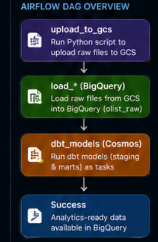
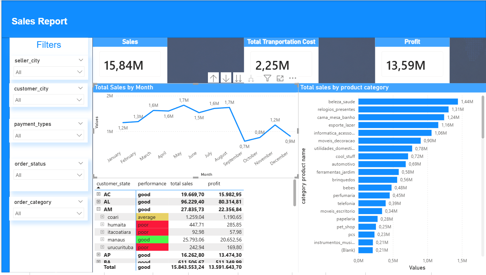

# E-Commerce Data Engineering Pipeline

## Overview

## 🚀 Overview

This project implements a **production-style modern data platform** for e-commerce analytics using Google Cloud Platform, dbt, Airflow, and BigQuery.

The pipeline ingests raw transactional data, stores it in a cloud-based data lake, transforms it into analytics-ready models using dbt, and orchestrates the full workflow using Apache Airflow (Astro).

The final warehouse is modeled using a **Star Schema** and visualized in Power BI for business analysis and reporting. 

```
Python → GCS (Data Lake) → BigQuery (Warehouse) → dbt (Transformation) → Airflow (Orchestration) → Power BI (Visulaization & Analysis)
```

---

## Tech Stack

| Layer | Tool | Role |
|---|---|---|
| Ingestion | Python | Download & upload data |
| Data Lake | Google Cloud Storage (GCS) | Raw storage |
| Warehouse | BigQuery | Scalable compute |
| Transformation | dbt | SQL modeling |
| Orchestration | Airflow (Astro) | Scheduling |
| Integration | Cosmos | dbt + Airflow bridge |
| Visualization | powerBI | analytics of marts |

---

## Project Structure

```
e-commerce/
├── dags/
│   └── olist_full_pipeline.py       # Airflow DAG
├── include/
│   ├── scripts/                     # Python ingestion scripts
│   └── gcp/
│       └── airflow-sa.json          # Service account key
├── dbt/
│   └── olist_dbt/
│       ├── models/
│       │   ├── staging/             # Cleaned raw data
│       │   └── marts/               # Fact & dimension tables
│       ├── dbt_project.yml
│       └── profiles.yml             # Used inside Airflow
├── requirements.txt
└── README.md
```

---

## Cloud Architecture
## 🏗️ Architecture

The project follows a layered modern data engineering architecture:

1. **Python ingestion layer** downloads and uploads raw datasets
2. **Google Cloud Storage (GCS)** acts as the raw data lake
3. **BigQuery** serves as the scalable cloud warehouse
4. **dbt** transforms raw tables into staging and analytics models
5. **Airflow (Astro)** orchestrates and schedules the entire pipeline
6. **Power BI** consumes the final marts layer for reporting and insights

### GCS — Data Lake

- Stores raw CSV files
- Landing zone before BigQuery ingestion

### BigQuery — Warehouse

```
olist_raw     → raw ingestion layer
olist_stage   → staging layer
olist_marts   → analytics-ready layer
```

---
## 📈 Key Results

- Built a fully orchestrated end-to-end cloud pipeline
- Implemented layered warehouse architecture (`raw → staging → marts`)
- Modeled analytics tables using a Star Schema
- Integrated dbt with Airflow using Cosmos
- Automated ingestion, transformation, and orchestration workflows
- Separated local and containerized execution environments
- Implemented data quality checks using dbt tests
- Created analytics-ready datasets for Power BI dashboards

---
## 🔐 Authentication & Environment Configuration

The project uses a Google Cloud **Service Account** to authenticate Airflow and dbt with GCP services.

Service account key location:

```text
include/gcp/airflow-sa.json

```
include/gcp/airflow-sa.json
```

Used for: GCS access, BigQuery access, dbt execution, and Airflow tasks.

> **Note:** Local path ≠ Docker container path.

| Environment | Path |
|---|---|
| Local | `/home/.../airflow-sa.json` |
| Container | `/usr/local/airflow/include/gcp/airflow-sa.json` |

---


# ▶️ How to Run

## 1. Clone Repository

```bash
git clone <your-repo-url>
cd e-commerce

This starts the Scheduler, Webserver, Worker, and Metadata DB. The project mounts inside the container at `/usr/local/airflow/`.

**Trigger the DAG:**

```
olist_full_pipeline
```

---

## Pipeline Orchestration

DAG execution order:

```
upload_to_gcs
      ↓
load_* (BigQuery)
      ↓
dbt_models (Cosmos)
```

---

## dbt + Cosmos Integration

Cosmos converts each dbt model into an individual Airflow task, instead of running everything as a single `dbt run` task.

**Configuration example:**

```python
DbtTaskGroup(
    group_id="dbt_models",
    project_config=ProjectConfig(
        dbt_project_path=DBT_PROJECT_PATH,
    ),
    profile_config=ProfileConfig(
        profile_name="olist_dbt",
        target_name="dev",
        profiles_yml_filepath=f"{DBT_PROJECT_PATH}/profiles.yml",
    ),
    execution_config=ExecutionConfig(
        dbt_executable_path=DBT_EXECUTABLE_PATH,
    ),
)
```

---

## 🔄 Transformation Layer (dbt)

The transformation layer follows a modular dbt architecture:

```text
raw → staging → dimensions/facts → analytics

- **Staging models** — clean and normalize raw data
- **Dimension tables** — provide descriptive context
- **Fact tables** — store measurable metrics

---

## Data Modeling — Star Schema

**Fact table:**

- `fct_sales` — item-level transactions (price, freight, total)
- `fct_orders` — order-level aggregations

**Dimension tables:**

- `dim_customers`
- `dim_products`
- `dim_sellers`
- `dim_date`

Star schema reduces redundancy, improves query performance, and is the industry standard for analytics warehouses.

---

## Data Visualization & Analysis
The final marts layer is consumed in Power BI for:

- Revenue analysis
- Order trends
- Customer insights
- Product performance
- Seller analysis

The warehouse was intentionally modeled to support BI tools efficiently using dimensional modeling principles.



## Data Quality

dbt tests applied across models:

- `not_null`
- `unique`
- `relationships`
- `store_failures` — tracks rejected rows for audit

---

## Mental Model

| Component | Role |
|---|---|
| Airflow | Orchestrator — schedules and triggers tasks |
| dbt | Transformation layer — SQL modeling |
| BigQuery | Compute engine — executes SQL at scale |
| GCS | Storage — raw file landing zone |
| Service Account | Authentication — GCP access credentials |

---

## Common Pitfalls

- Wrong service account key path (local vs. container)
- Mixing local and container config values
- dbt `profiles.yml` pointing to wrong target
- Python dependency conflicts in the Astro environment
